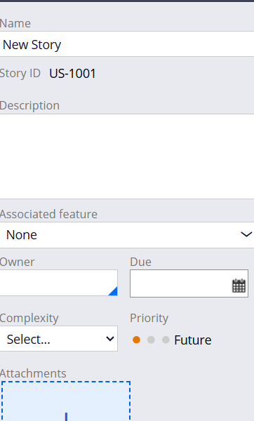
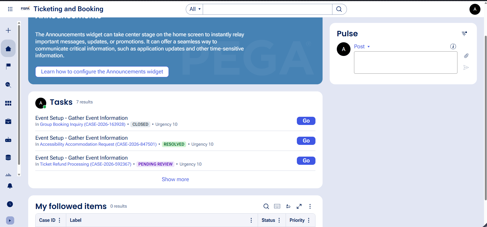
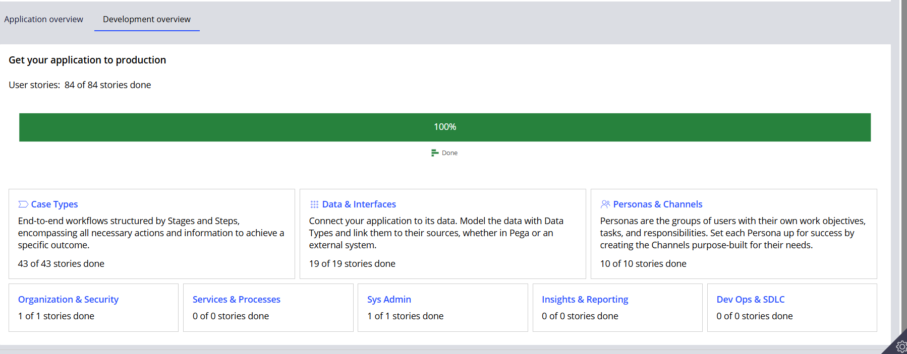
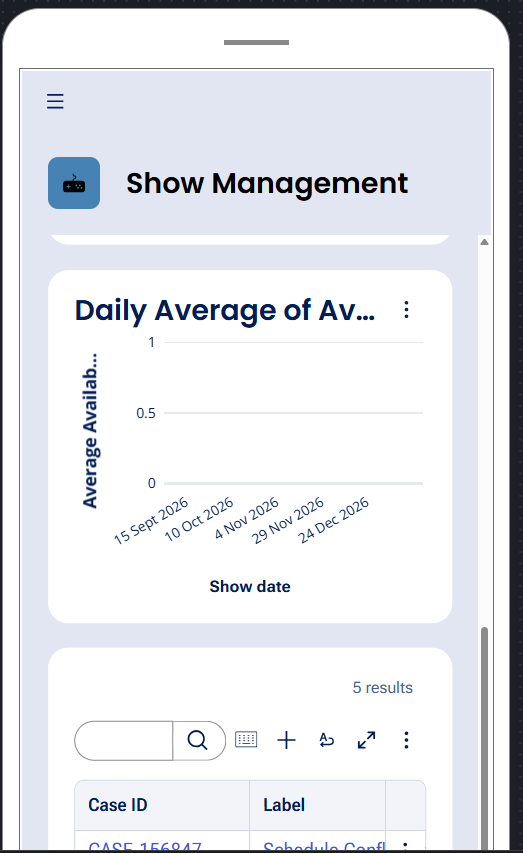
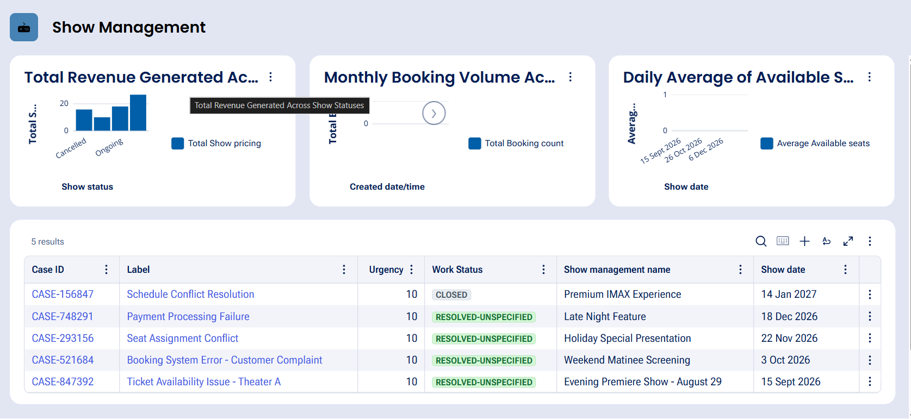
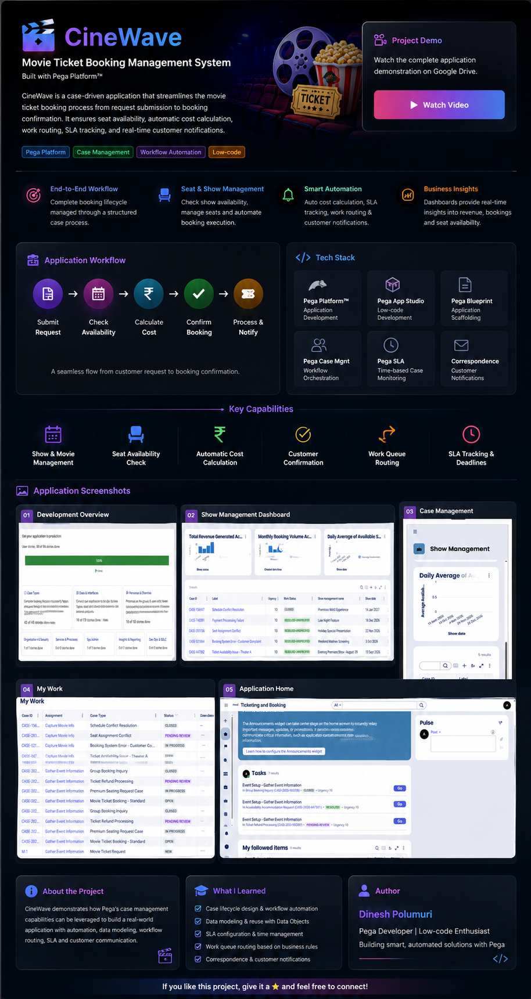

# 🎬 CineWave — Movie Ticket Booking Management System

### A Case-Driven Movie Ticket Booking Workflow Built with Pega Platform™

 

---

# 📌 Table of Contents

- [Project Overview](#-project-overview)
- [Problem Statement](#-problem-statement)
- [Solution](#-solution)
- [Project Objectives](#-project-objectives)
- [Technology Stack](#-technology-stack)
- [Application Architecture](#-application-architecture)
- [Case Types](#-case-types)
- [Case Lifecycle](#-case-lifecycle)
- [Data Model](#-data-model)
- [User Stories](#-user-stories)
- [Business Logic](#-business-logic)
- [SLA Configuration](#-sla-configuration)
- [Work Queue Routing](#-work-queue-routing)
- [Notification Flow](#-notification-flow)
- [Application Workflow](#-application-workflow)
- [Testing](#-testing)
- [Project Structure](#-project-structure)
- [Screenshots](#-screenshots)
- [Learning Outcomes](#-learning-outcomes)
- [Future Enhancements](#-future-enhancements)
- [Author](#-author)

---

# 🎞️ Project Overview

**CineWave** is a Movie Ticket Booking Management application designed using the **Pega Platform™**.

The application manages the complete journey of a movie ticket booking request.

A customer can initiate a booking request, provide movie and show information, check availability, review the calculated booking cost, confirm the booking, and receive confirmation after the booking process is completed.

The application uses **case management**, **data objects**, **business rules**, **service-level agreements**, **work queues**, and **automated correspondence** to create a structured booking workflow.

---

# 🚨 Problem Statement

Movie ticket booking requests can become difficult to manage when the process depends on:

- Manual communication
- Email-based requests
- Offline tracking
- Manual seat availability verification
- Manual booking status updates
- Delayed customer communication

These approaches can lead to several problems.

## Common Challenges

### 📩 Lack of Centralized Tracking

Booking requests may be spread across multiple systems or communication channels.

This makes it difficult to determine:

- Which requests are pending
- Which requests are confirmed
- Which bookings require action
- Who is responsible for processing a request

---

### ⏳ Delays in Booking Processing

Without an automated workflow, staff members must manually review each request.

This can result in:

- Delayed availability checks
- Delayed booking confirmation
- Delayed customer communication

---

## 🎥 Project Demonstration

Watch the complete demonstration of the **CineWave — Movie Ticket Booking Management System**:

▶️ **[Watch the Project Demo Video](https://drive.google.com/file/d/16UJsso6YDOQuXfghSqiu5q1U4K4hepMo/view?usp=sharing)**

## 🎥 Application Demo

The video demonstrates the Movie Ticket Request workflow and the implemented Pega application features.
The booking price may need to be calculated manually.

## 📸 Application Screenshots

### 1. Development Overview

The development overview shows the progress of the application, including completed case types, data objects, personas, and channels.

---

### 2. Show Management Dashboard

The Show Management dashboard displays important information such as revenue, booking volume, available seats, and show records.

---

### 3. Case Management

This screen displays the Show Management cases and their current work status.

---

### 4. My Work

The My Work section displays tasks assigned to users, including case types and their current status.

---

### 5. Application Home

The application home page provides access to tasks, announcements, and other application features.

stateDiagram-v2

    [*] --> New

    New --> InformationCaptured

    InformationCaptured --> AvailabilityCheck

    AvailabilityCheck --> BookingProcessing

    BookingProcessing --> Confirmed

    BookingProcessing --> Cancelled

    Confirmed --> Resolved

    Cancelled --> Resolved

    Resolved --> [*]

Case Types             ████████████████████  100%

Data & Interfaces      ████████████████████  100%

Personas & Channels    ████████████████████  100%

User Stories           ████████████████████  100%

Application Testing    ████████████████████  100%

┌─────────────────────────┐
│ 👤 CUSTOMER REQUEST     │
└────────────┬────────────┘
             │
             ▼
┌─────────────────────────┐
│ 🎬 SELECT MOVIE         │
└────────────┬────────────┘
             │
             ▼
┌─────────────────────────┐
│ 📅 SELECT SHOW          │
└────────────┬────────────┘
             │
             ▼
┌─────────────────────────┐
│ 💺 CHECK AVAILABILITY   │
└────────────┬────────────┘
             │
             ▼
┌─────────────────────────┐
│ 💰 CALCULATE COST       │
└────────────┬────────────┘
             │
             ▼
┌─────────────────────────┐
│ ✅ CUSTOMER CONFIRMATION│
└────────────┬────────────┘
             │
             ▼
┌─────────────────────────┐
│ 🎟️ PROCESS BOOKING     │
└────────────┬────────────┘
             │
             ▼
┌─────────────────────────┐
│ 📩 NOTIFY CUSTOMER      │
└────────────┬────────────┘
             │
             ▼
        🎉 RESOLVED

                        👤 CUSTOMER
                              │
                              ▼
              ┌────────────────────────────┐
              │   🎬 CINEWAVE APPLICATION │
              └─────────────┬──────────────┘
                            │
                            ▼
              ┌────────────────────────────┐
              │  🎟️ MOVIE TICKET REQUEST │
              │           CASE             │
              └─────────────┬──────────────┘
                            │
          ┌─────────────────┼─────────────────┐
          │                 │                 │
          ▼                 ▼                 ▼
      🎬 MOVIE          📅 SHOW         ⚙️ BUSINESS
     DATA OBJECT       DATA OBJECT         LOGIC
          │                 │                 │
          └─────────────────┼─────────────────┘
                            │
                            ▼
                   🔄 CASE LIFECYCLE
                            │
                            ▼
                   🔀 WORK ROUTING
                            │
                            ▼
                   📩 NOTIFICATION
                            │
                            ▼
                      🎉 RESOLVED

                      
